# Pre-Event Setup Guide — WIT IT^3 Conference: IBM Workshop — Bob-a-thon

> **Complete these steps before arriving on September 24.**
> The entire setup takes about 10–15 minutes. If you run into trouble, join an
> **office hours session on September 21 or September 22** and an IBM facilitator will help you.

> 📅 **Come to office hours on September 21 or September 22.** If anything in these steps doesn't work for you, don't wait until the day of the event. Office hours are specifically there to fix setup problems before the workshop — it's much easier to resolve issues before September 24 than on the morning of.

---

## Step 1 — Verify or create your IBMid

An IBMid is your login for IBM services, including TechZone (where your lab VM lives).
If you already use any IBM product or have participated in an IBM event before, you likely
already have one.

### Do you already have an IBMid?

1. Go to **[ibm.com/account](https://www.ibm.com/account)**
2. Click **Log in**
3. Enter your **work email address** and click **Continue**
4. If the sign-in succeeds, you have an IBMid — **proceed to Step 2**
5. If you see "No account found" or are prompted to register, continue below to create one

> 💡 **Use your work email address.** IBM will assign your lab VM to the same email
> address you use here. A mismatch between the two will prevent you from accessing your VM.

---

### Creating a new IBMid

If you don't have an IBMid yet, register one now:

1. Go to **[ibm.com/account/reg/us-en/signup](https://www.ibm.com/account/reg/us-en/signup)**

   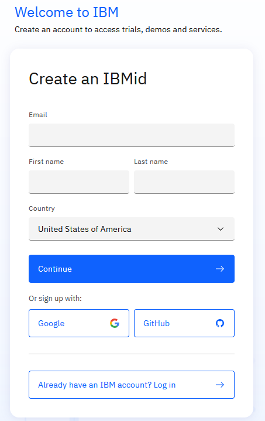

2. Fill in the form:
   - **Email address** — enter your **work email address** (the address IBM will use to assign your VM)
   - **First name**, **Last name**, **Country/region**
   - Create a **password** (note it somewhere safe)

3. Click **Create account**

4. Check your work email inbox for a **verification email from IBM** and click the
   **Verify** link to activate your account

5. Return to **[ibm.com/account](https://www.ibm.com/account)** and sign in to confirm
   your IBMid works

> ⚠️ **Important:** Once created, your IBMid is tied to the email address you used.
> Let your IBM event contact know immediately if you registered with a different address
> than the one they have on file — they will need to re-assign the VM.

---

## Step 2 — Access TechZone and find your VM

IBM will assign your lab VM to your IBMid before the event. Once assigned, it appears in
your TechZone account under **My TechZone → My Requests**.

> **Your reservation may not appear until a few days before the event** — IBM is
> provisioning and assigning VMs between September 18–21. If you check before September 18
> and don't see anything yet, that's expected. Check back closer to the event, and confirm
> access by the **September 21 or September 22 office hours sessions**.

> 📧 **You may receive an email from IBM Bob before the event.** Do not follow the instructions in that email — ignore it and follow the setup steps below instead.

---

### 2a — Sign in to TechZone

1. Go to **[techzone.ibm.com](https://techzone.ibm.com)**

2. Click **Sign in** in the top-right corner

3. Sign in with your **IBMid** (your work email address and password)

4. You should land on the TechZone home/dashboard page

   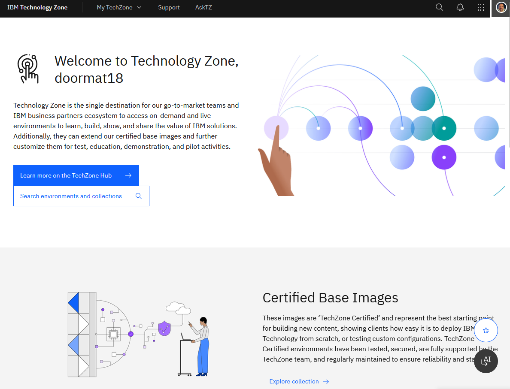

---

### 2b — Find your reservation

1. In the TechZone navigation, click **My TechZone** → **My Requests**

   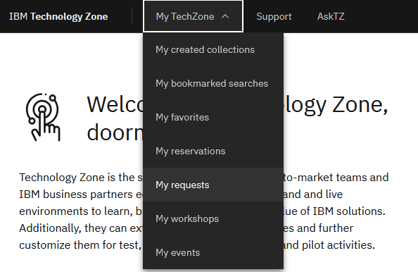

2. Look for a reservation with a name similar to **"Bob IDE"** or containing **"Bob"**
   - Status should be **Ready** or **Active** once provisioning is complete

   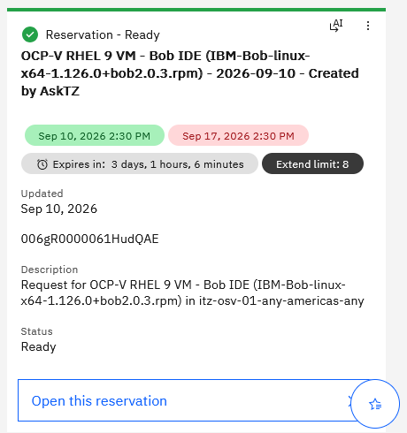

3. Click on the reservation to open its detail page

> **Don't see your reservation?**
> - Make sure you are signed in with the **correct work email address** — the same one you
>   gave to your IBM event contact
> - If it's before September 18, your VM may simply not have been assigned yet — check back
>   in a day or two
> - If you still don't see it after September 18, reach out to your IBM contact or come to
>   an **office hours session on September 21 or September 22**

---

## Step 3 — Connect to your VM

Your lab environment is a Linux desktop you access directly in your browser — no VPN,
no SSH, no software to install.

1. On the reservation detail page, scroll down to the **Environments** table. Find the row
   for **OCP-V RHEL 9 VM - Bob IDE** and click the **twisty arrow** (▶) on the left to
   expand it

   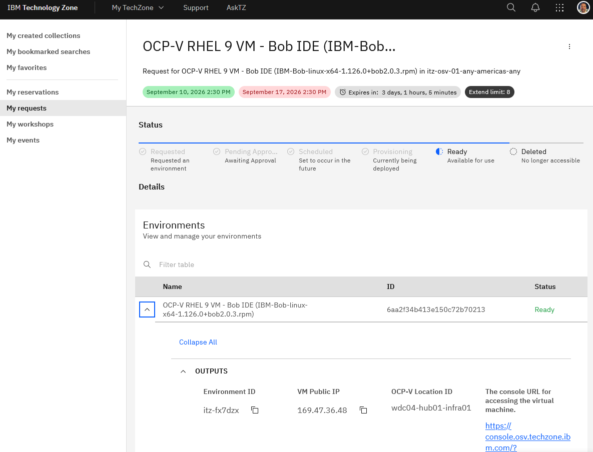

2. In the expanded section, locate **"The console URL for accessing the virtual machine"**
   and click the link

   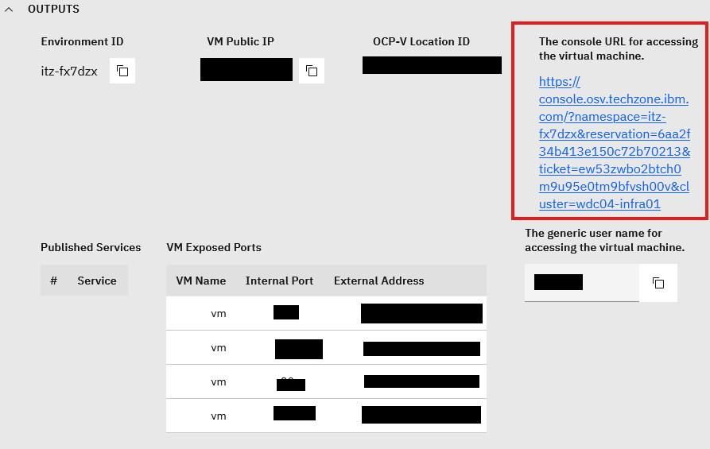

3. A new browser tab opens showing the OCP-V console. You may be prompted to sign in with
   your **IBMid** again at this point — use the same work email address and password. Once
   signed in, find your VM in the list and click the **Console** button

   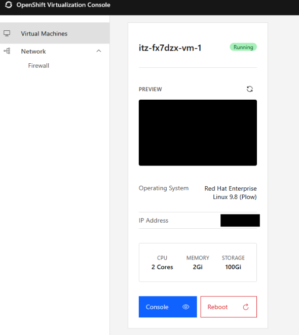

4. Another tab opens showing the RDP connection page. Click **Connect with RDP**

   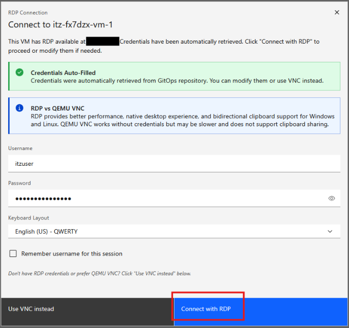

5. The RHEL desktop will load — you should see the home screen with the desktop and taskbar

   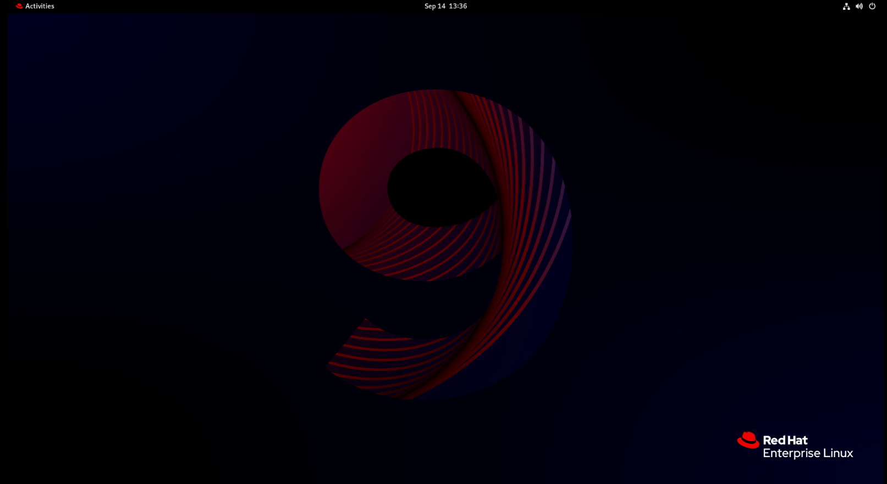

> 💡 **Working with the OCP-V RDP Web Console & Sending Text:**
> - **Sending text / clipboard into the VM:** Because this is a browser-based RDP web console, standard local copy-paste (Ctrl+V / Cmd+V) may not directly transfer text into the remote desktop. Instead, use the **"Send Text"** button in the toolbar across the top of the console window to paste and send text into the VM.
> - **Login & Password prompts:** If you encounter a login or password prompt, you can use the **"Send Text"** button to send text into the prompt. Note that the toolbar also includes a dedicated button specifically to send/paste the password.
> - **Browser tips:** Chrome and Edge both work well. If any tab shows a blank or black screen, wait 30 seconds and refresh it.

---

## Step 4 — Launch Bob from the terminal

> ⚠️ **Important:** Do **not** double-click the Bob desktop icon. It must be launched
> from a terminal with a specific flag — otherwise Bob may freeze on the first launch.

1. Inside the browser tab (the RHEL desktop), click **Activities** in the top-left corner
   of the screen. A dock appears along the bottom — click the **terminal icon** (it looks
   like a black screen with a command prompt)

   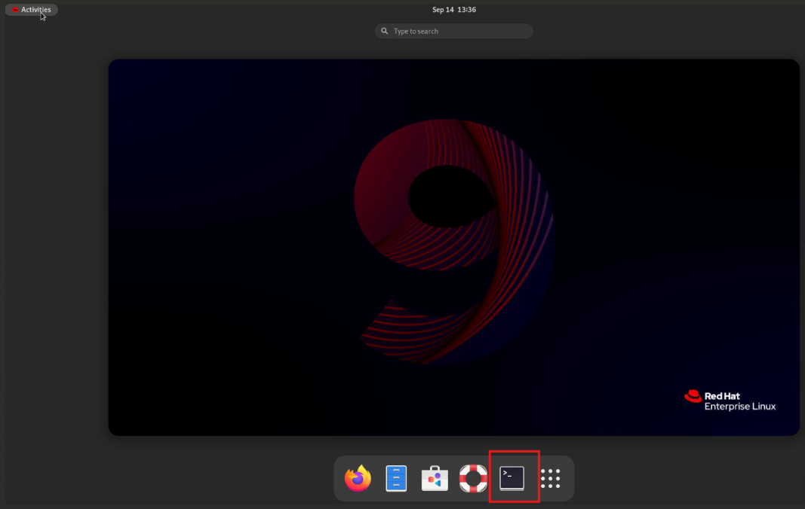

2. In the terminal, type the following command and press **Enter**:

   ```bash
   bobide --password-store=basic
   ```

3. Bob will launch. On the very first launch it may take 15–30 seconds to start — this
   is normal

4. **First-launch prompts** — Bob shows several one-time prompts the first time it opens.
   Handle each one as follows:

   - **"Import settings from other editors?"** — Click **Skip** (you do not need to import
     any settings from VS Code or other editors)

   - **"Migrate Bob v1.0.0 chats?"** — A modal window will ask if you want to migrate chats
     from a previous version. Click **Skip migration**

   - **"A new update is available!"** — A small notification may appear in the bottom-right
     corner of the Bob window. You can safely **ignore it or close it** — do not install the
     update during the workshop

5. When Bob finishes loading, you will see a **Log in to Bob** button. Click it

   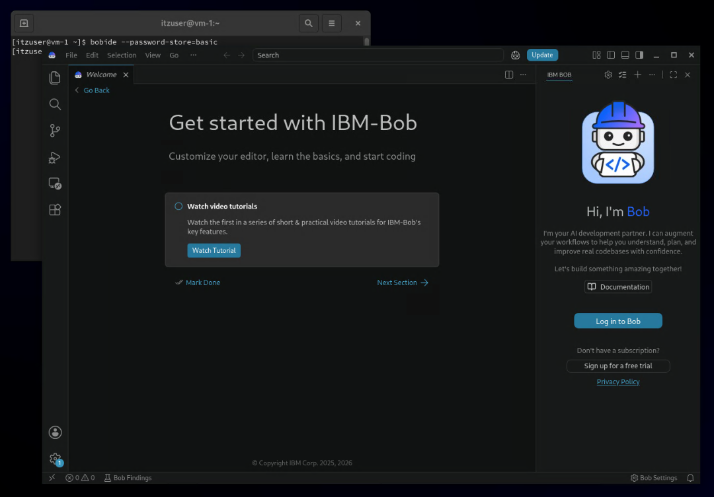

   > 💡 **Security warning:** When you click **Log in to Bob**, your operating system or
   > browser may show a security prompt asking if you want to allow Bob to open a browser
   > window. Click **Allow** (or **Open**, depending on the prompt) to continue.

6. A browser window opens automatically. Sign in with your **IBMid** (work email address
   and password) — the same account you verified in Step 1

7. After signing in, return to the Bob window. Bob should show the chat panel on the
   right side of the interface — you're authenticated and ready

   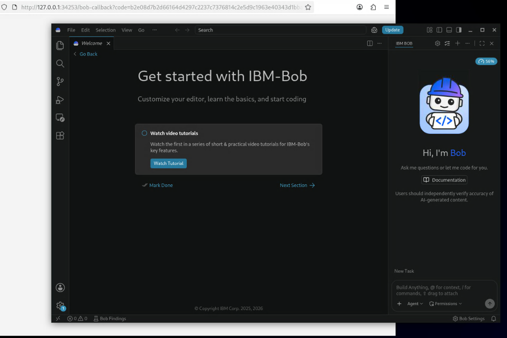

---

## Step 5 — Load the lab files into Bob

The workshop labs are stored in a Git repository. You will clone it directly inside Bob
using the built-in Source Control view — no terminal needed.

1. In Bob, click the **Source Control icon** in the left sidebar (it looks like a branching
   line with a circle — third icon from the top)

2. Click **Clone Repository**

3. A text field appears at the top of the screen. Paste the lab repository URL:

   ```
   https://github.com/ibm-client-engineering/it3-bobathon
   ```

   *(Note: Since you are in the OCP-V web RDP console, use the **"Send Text"** button at the top of the console window to paste the repository URL into the VM if standard copy-paste does not transfer over).*

   Press **Enter**

4. A folder picker opens asking where on the VM disk to save the cloned repository. You can select any location on disk (such as `Documents` or your home directory), or optionally create a dedicated folder:
   - Navigate to **Documents** (or your preferred location)
   - Click **New Folder** (for example, named `boblabs` or similar) and select it
   - Click **Select as Repository Destination**

   > 💡 Creating a named folder like `boblabs` keeps your lab files clean and easy to find on the VM disk.

5. Bob will clone the repository. When it finishes, a prompt appears asking
   **"Would you like to open the cloned repository?"** — click **Open**

   > 💡 **What does "Open in Bob" mean?** This is Bob's way of asking whether to load the cloned folder into its workspace so it can read and work with the files. Click **Open** — you should then see the lab folder (`it3-bobathon`) appear in the Explorer panel on the left side of the Bob window.

6. Bob may display a permission prompt asking if it can access files in this folder — click **Allow** (or **Yes**) to continue. This is expected and required for Bob to read the lab files.

7. You may see a dialog asking **"Do you trust the authors of the files in this folder?"** — click **Yes, I trust the authors**. Without this, Bob cannot read or work with the lab files.

8. You may also see a prompt asking you to install an update — click **Skip** (or close the dialog). You do not need to update Bob before the lab.

   > 💡 **Hard double-click to expand folders.** In the Explorer panel, use a firm double-click to expand a folder — there may be a short delay before it opens. Wait a moment before clicking again.

9. Confirm the files loaded: in the Explorer panel on the left, you should see folders named `Lab 1 - Productivity`, `Lab 2 - Research`, `Lab 3 - Developer Efficiency`, and a `README.md` file at the top level. If you don't see these, ask your IBM facilitator.

> ✅ **Setup complete — stop here.** Bob is open, authenticated, and the lab files are
> loaded. **Do not send any prompts yet.** Every message to Bob uses Bobcoins, and you want
> to save them for the workshop labs. Leave Bob open until the event starts.

---

## Step 6 — Read the README before starting

Once you arrive at the event and are ready to begin:

1. In the Explorer panel on the left, click **`README.md`** at the top level of the `it3-bobathon` folder to open it
2. Read it in full — it explains the lab structure, how to use the Bob chat panel, permissions, and where to go for help
3. After reading the README, open `Lab 1 - Productivity/instructions.md` and start a new Bob chat — that's your starting point

---

## Troubleshooting

| Problem | What to do |
|---|---|
| IBMid registration email never arrived | Check spam/junk folder; try resending from the IBMid registration page |
| "No account found" at TechZone sign-in | Confirm you're using the same work email as your IBMid |
| No reservation visible in My Requests | If it's before Sep 18, check back later; if after Sep 18, contact your IBM event contact |
| Reservation shows but status is "Pending" | Provisioning is still in progress — check back in 30–60 min |
| No "OCP-V RHEL 9 VM - Bob IDE" row in Environments table | Scroll down on the reservation detail page; if missing, contact your IBM facilitator |
| Console URL link is missing from the expanded row | The VM may still be provisioning — wait a few minutes and refresh the page |
| Prompted to sign in again at the OCP-V console | Sign in with your IBMid (same work email and password) — this is expected |
| RDP connection tab shows a blank or black screen | Wait 30 sec then refresh; if it persists, close the tab and click the console URL again |
| Cannot paste text/URLs/passwords into VM | Use the **"Send Text"** button (or the dedicated password button) in the top toolbar of the OCP-V RDP web console |
| Bob freezes immediately on launch | Close Bob; reopen the terminal and run `bobide --password-store=basic` |
| "Log in to Bob" button doesn't appear | Wait 30 sec; if still missing, close Bob and relaunch with `bobide --password-store=basic` |
| Security warning when clicking Log in to Bob | Click **Allow** or **Open** — this is expected and safe |
| Browser doesn't open when clicking Log in | Look for a browser window behind the Bob window, or open a browser manually and try signing in again |
| Bob asks for credentials you don't recognize | Use your IBMid work email and password — the same one you registered in Step 1 |
| Can't find the terminal | Click **Activities** (top-left), then click the terminal icon in the dock at the bottom |
| "Clone Repository" shows an error or "repository not found" | Confirm you pasted the full URL: `https://github.com/ibm-client-engineering/it3-bobathon` — then try again |

**Still stuck?** Come to an **office hours session on September 21 or September 22** or reach out to your
IBM event contact before the day of the workshop. Issues are much easier to resolve before
September 24 — please don't wait until you arrive.

---

*WIT IT^3 Conference: IBM Workshop — Bob-a-thon · September 24, 2026 · Charlotte & Atlanta*
